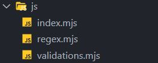
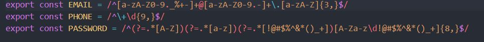
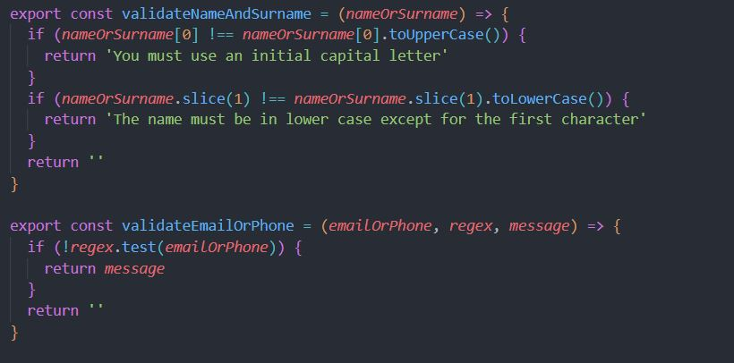
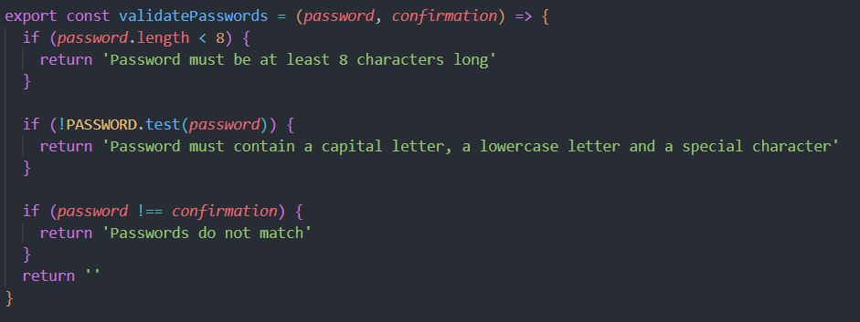
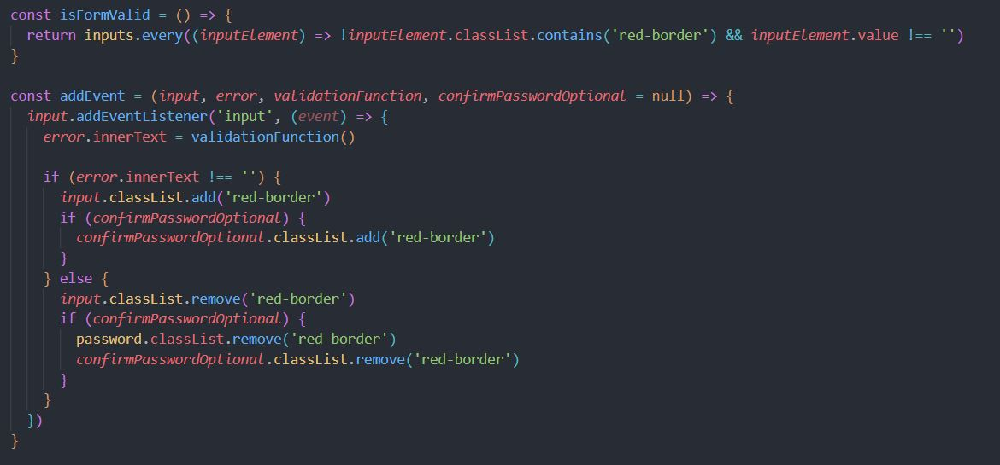
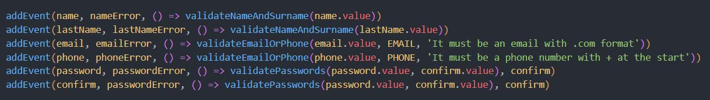
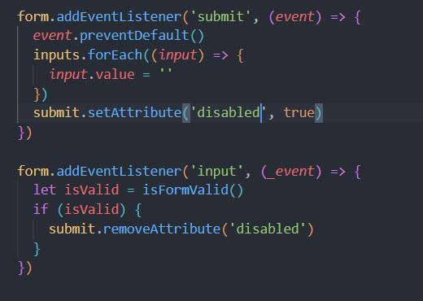

# Sign-up-form-TOP

A sign up form for the odin project to implement form validation in JavaScript

# What the project is about

This project is the first project in the full-stack path. The project is a sign-up form with validation through JavaScript code.

# What have I learned so far?

In this project I split the code in different files to organise it better as well as improved my leverage of functions to not repeat myself.

<ul>
  <li>Imports and exports through ES6 syntax.</li>
  <li>Callbacks.</li>
  <li>Use of functions to write DRY code.</li>
  <li>Optional default parameters for functions.</li>
  <li>Validation of form inputs.</li>
</ul>

# Want to see it in action?

<a href="https://hroglardev.github.io/Sign-up-form-TOP/" target="_blank">Click here</a>

# Explanation of the code

The code is split into three files for better organisation.

The regex file contains three constants that we use for validations of the respective input fields.

The email constant regex is a pattern that checks for a word, followed by an "@" followed by another word and ending with a dot characters followed by three characters.

The phone constant regex is a pattern to check for a string that starts with "+" and 9 numbers.

The password constant regex is used to check for a string that contains a capital letter, a lower case character and a special character.

The validation file contains the functions that we use to validate the inputs.

The first function receives a string as an argument and checks first if the first character is capitalised by comparing it with itself. Next it checks if the rest of the word is in lower case by comparing it against itself by removing the first character from the string.

If some condition is true, the appropiate error message is displayed. If not, then an empty string is returned.

The second function makes use of the regex constants "EMAIL" and "PHONE" to test the input value against it and see if it respects the requested pattern.

If it doesn't it returns a message passed as a parameter to the function.

The last function does three checks.

First it checks if the password is at least 8 characters long.

Secondly is checks if the password contains the characters previously described in the PASSWORD constant regex.

And lastly it checks if the input password matches the confirmation of it (which is input in a separate input)

If it passes the three checks, it returns an empty string and should it fail any of them, it returns an error message prioritising the conditions in order of check.

The code in the main file starts with a function that checks if all the inputs pass two conditions. If the input has the class "red-border" and if the input has something written into it.
If both conditions pass, the function returns true.

The next function takes 4 arguments (notice that the last argument has a default value of null).

The first parameter is an input element, the second one represents the error paragraph to be displayed below the input. The third parameter is a function that will validate the input value (i.e what the user writes into it).

The function adds the input event listener (that way, each time the user presses a key into one of the inputs, the validation is executed to perform the appropiate checks).

The return value is assigned as the text for the paragraph element that will display the error.

If the return value of the validator function is not an empty string, the input displays a red border (by adding the class) and if the confirmPasswordOptional is not null, it also adds the class to that element.

On the other hand, if it is an empty string, the classes are removed to display to proper border (blue) on focus.

Following the function, it is called six times to add the events to each input and display the error that corresponds to each one of themby passing each input, its error sibling element and the according validator function except for the last two cases in which the confirm element is passed as a fourth argument to be able to link both password inputs.

Following this, the code adds an event listener for the form's submission.

First it prevents the page from reloading by calling the preventDefault function on the event object.

Then it resets all the inputs' value to empty and resets the property of the submit button to be disabled.

Finally it adds another event on the form to remove the disabled attribute of the submit button once every input has a value that fulfills the conditions in the validator functions.

# Want to track my progress?

Checkout my other projects in order to see my evolution:

<ol>
  <li><a href="https://github.com/hroglardev/odin-recipes" target="_blank">Recipes</a></li>
  <li><a href="https://github.com/hroglardev/Odin-landing-page" target="_blank">Landing Page</a></li>
  <li><a href="https://github.com/hroglardev/Rock-Paper-Scissors-TOP-Console" target="_blank">You are here</a></li>
  <li><a href="https://github.com/hroglardev/Rock-Paper-Scissors-TOP" target="_blank">Rock, Paper, Scissors</a></li>
  <li><a href="https://github.com/hroglardev/Etch-a-Sketch" target="_blank">Etch a Sketch</a></li>
  <li><a href="https://github.com/hroglardev/Calculator" target="_blank">Calculator</a></li>
  <li><a href="https://github.com/hroglardev/Sign-up-form-TOP" target="_blank">You are here</a></li>
  <li><a href="https://github.com/hroglardev/Dashboard" target="_blank">Dashboard</a></li>
  <li><a href="https://github.com/hroglardev/Library" target="_blank">Library</a></li>
  <li><a href="https://github.com/hroglardev/Tic-tac-toe" target="_blank">Tic-tac-toe</a></li>
  <li><a href="https://github.com/hroglardev/Restaurant-page" target="_blank">Restaurant page</a></li>
  <li><a href="https://github.com/hroglardev/To-do-list-js" target="_blank">To-do list</a></li>
</ol>
